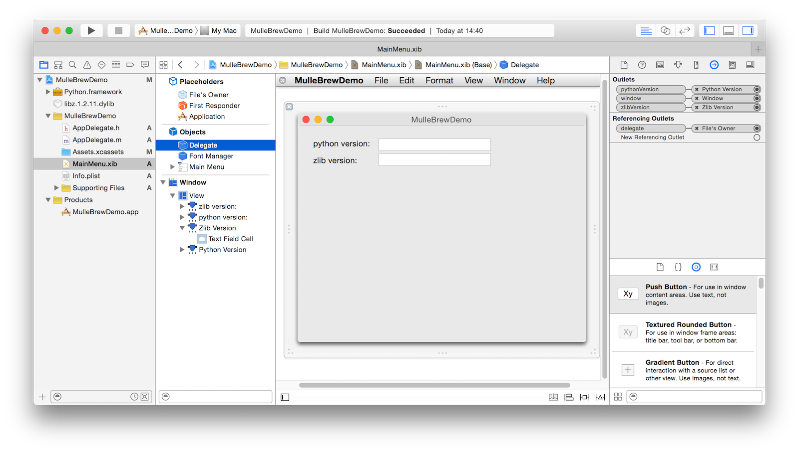
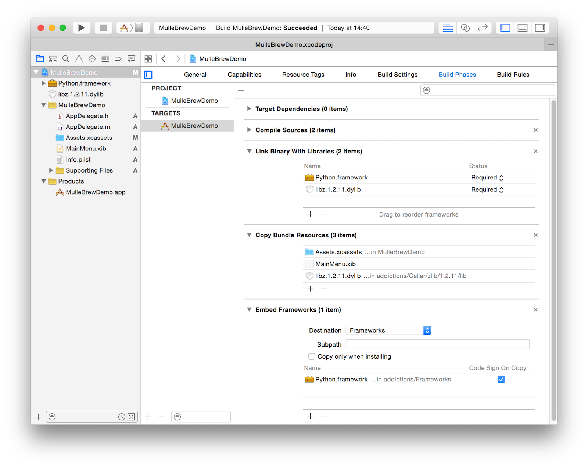

# mulle-brew, C/C++/Objective-C developer "sandboxing" with homebrew


[Homebrew](//brew.sh) is the de facto standard package manager of OS X. It is also
available on Linux as [Linuxbrew](linuxbrew.sh).

By default homebrew installs packages system-wide into `/usr/local/` (on OS X). But you can actually clone the [brew repository](https://github.com/Homebrew/brew/) to any place in the filesystem. `brew` will then install its packages into that place. This is a convenient way to create your own playground development environment of tools and libraries. **mulle-brew** helps you set up and share such playgrounds.

## Advantages

* Keep the runtime and your system clean from temporary downloads.
* Updating brew libraries for one project, doesn't necessarily impact parallel projects
* An easy way to share the required build environments
* A uniform way to access those dependencies via a known folder name `addictions`


## Installing **mulle-brew**

Install **mulle-brew** with brew, it makes sense :) :

```
brew install mulle-kybernetik/alpha/mulle-brew
```

## Install and run hello world using **mulle-brew**

Install [hello](https://www.gnu.org/software/hello/):

```
mulle-brew init
mulle-brew setting -g -r brews hello
mulle-brew
```

Run hello:

```
mulle-brew run hello
```

`mulle-brew run` adds `addictions/bin` to your PATH
shell variable so that **hello** is found for the duration of this command.
You could as well have used `./addictions/bin/hello`. The use of
`mulle-brew run` becomes more useful in more complex scenarios.


## Install libraries and use them with C or cmake

Install **libpng** and **zlib**:

```
mulle-brew init
mulle-brew setting -g -r brews libpng
mulle-brew setting -g -r -a brews zlib
mulle-brew
```

Now let's create a small test program `x`. Here is the C Source:

```
cat <<EOF > x.c
#include <png.h>
#include <zlib.h>

main()
{
   printf( "png version: %u\n", png_access_version_number());
   printf( "zlib version: %s\n", zlibVersion());
   return( 0);
}
EOF
```

#### Build x with a C compiler

Build `x.c` as `x` with **cc** and run it:

```
flags="`mulle-brew paths -l cflags`"
mulle-brew run cc ${flags} -o x x.c
mulle-brew run ./x
```

If you are running `mulle-brew paths -l cflags` in `/tmp` it will produce this
line:

```
-I/tmp/addictions/include -F/tmp/addictions/Frameworks -L/tmp/addictions/lib -lpng -lpng16 -lz
```

`mulle-brew paths cflags` on its own produces the -I, -F and -L flags. The `-l` option collects all the available libraries from `addictions/lib` and adds them as commandline options.


#### Build x with cmake


Create a `CMakeLists.txt`:

```
cat <<EOF > CMakeLists.txt
cmake_minimum_required (VERSION 3.0)
project (x)

find_library( PNG_LIBRARY NAMES png)
find_library( ZLIB_LIBRARY NAMES z)

add_executable( x
x.c)

target_link_libraries( x
\${PNG_LIBRARY}
\${ZLIB_LIBRARY}
)
EOF
```

Build it with `cmake` and `make`:

```
mulle-brew run mkdir build
mulle-brew run cd build
mulle-brew run cmake `mulle-brew paths cmake` ..
mulle-brew run make
mulle-brew run ./x
```

> Check with `otool -L x` that indeed the libraries from `addictions/lib` have been picked up.


## Make homebrew libraries and frameworks embeddable in your OS X Applications

If you install libraries and frameworks with homebrew, you will notice that
you can not embed them into your own applications, because homebrew does not
build them with [@rpath](https://developer.apple.com/library/content/documentation/DeveloperTools/Conceptual/DynamicLibraries/100-Articles/RunpathDependentLibraries.html).

`mulle-brew install -r` will fix this for you.

> Since `mulle-brew run` not only changes the `PATH` but also sets up
> `DYLD_FALLBACK_LIBRARY_PATH` and `DYLD_FALLBACK_FRAMEWORK_PATH`, binaries
> in `addictions/bin` will continue to run when executed with `mulle-brew run`.


#### Embed homebrewed Frameworks in Xcode

Assume you already have an app set up, and you want to embed a framework
int it:

1. Make sure you have run `mulle-brew install -r` so all frameworks
are relocatable
2. Link against the framework in the `addictions/Frameworks` folder.
In Xcode locate the **"Embed Frameworks"** build phase. Press the **+**
button, then choose **"Add Other..."**. Then navigate to `../addictions/Frameworks`
and add the framework.
3. Build and it should work. Test relocatability by copying the App to your
Desktop and starting from there.


#### Embed homebrewed shared libraries in Xcode

Assume you already have an app set up, and you want to embed a shared library
in it:

1. Make sure you have run `mulle-brew install -r` so all shared libraries are
relocatable
2. Link against the shared library in the `addictions/lib` folder.
In Xcode locate the **"Link Libraries with Binary"** build phase. Press the **+**
button, then choose **"Add Other..."**. Then navigate to `../addictions/lib` and add
the library (don't copy). Use the most qualified version. E.g. if you have a
choice between `libz.dylib`, `libz.1.dylib`, `libz.1.2.11.dylib` choose
`libz.1.2.11.dylib`.
3. The library should now appear in the "Project navigator". Drag it into
the **"Copy Bundle Resources"** build phase of your app.
4. Build and it should work. Test the relocatability of your app by copying it to your
Desktop and starting the app from there.


### Example: MulleBrewApp

[MulleBrewApp](//github.com/mulle-nat/MulleBrewApp) is an example that shows
an App embedding the **Python** framework and the **zlib** shared library using the
techniques above.

The initial setup was done with:

```
mulle-brew init
mulle-brew setting -g -r brews zlib
mulle-brew setting -g -r -a brews python
mulle-brew install -r
```

The App is a stock Xcode app for Objective-C without any specialties added.

Only `AppDelegate.m` and `MainMenu.nib` have been modified to retrieve zlib and
python version strings and place them into `NSTextField`s:



```
#import "AppDelegate.h"
#import <Python/Python.h>
#include <zlib.h>


@interface AppDelegate ()

@property (weak) IBOutlet NSWindow *window;
@property (weak) IBOutlet NSTextField *zlibVersion;
@property (weak) IBOutlet NSTextField *pythonVersion;

@end


@implementation AppDelegate

- (void) applicationDidFinishLaunching:(NSNotification *) aNotification
{
   [self.zlibVersion setStringValue:[NSString stringWithUTF8String:zlibVersion()]];
   [self.pythonVersion setStringValue:[NSString stringWithUTF8String:Py_GetVersion()]];
}

@end
```

Then the library and framework have been added as explained above:



And it just worked.


## Tips

### Keep a cache of homebrew locally

Cloning **brew** from GitHub for every project can get tedious. You can use a
local cache with:

```
mulle-brew config -u "clone_cache" "${HOME}/Library/Caches/mulle-brew"
```

### Use a shell to run multiple commands

Prefixing everything with mulle-brew can be tedious. Use a subshell:

```
mulle-brew run "${SHELL}"
```

### Start Xcode with mulle-brew

If Xcode uses tools in your binary folder, it can be useful to start Xcode in the proper environment, so open your project like so:

```
mulle-brew run open Foo.xcodeproj
```


### Sharing addictions with other projects

You might find that you have multiple projects with overlapping dependencies on
brew formula and the duplication becomes tedious. You can create a "master"
playground in the common parent directory with:

```
mulle-brew defer
```

And revert back to a private playground with

```
mulle-brew emancipate
```

Here the use of `mulle-brew paths` comes in handy, as it adapts to the
new position of the `addictions` folder in the filesystem.


## GitHub and Mulle kybernetiK

The development is done on
[Mulle kybernetiK](https://www.mulle-kybernetik.com/software/git/mulle-bootstrap/master).
Releases and bug-tracking are on
[GitHub](https://github.com/mulle-nat/mulle-bootstrap).


